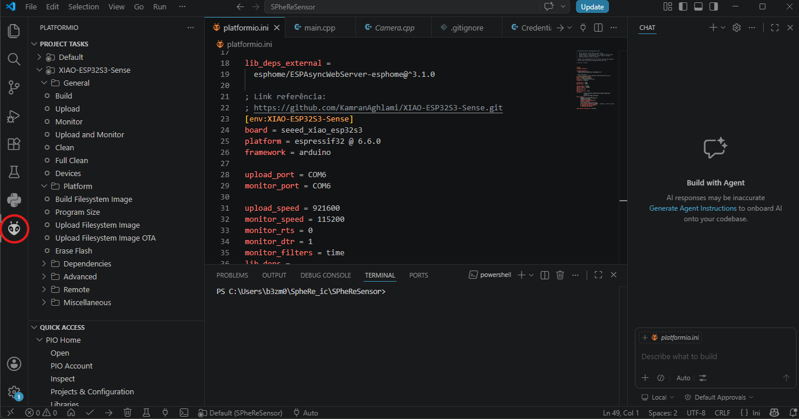
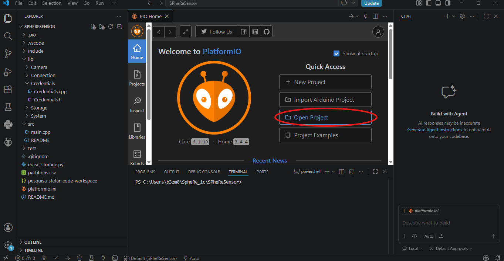
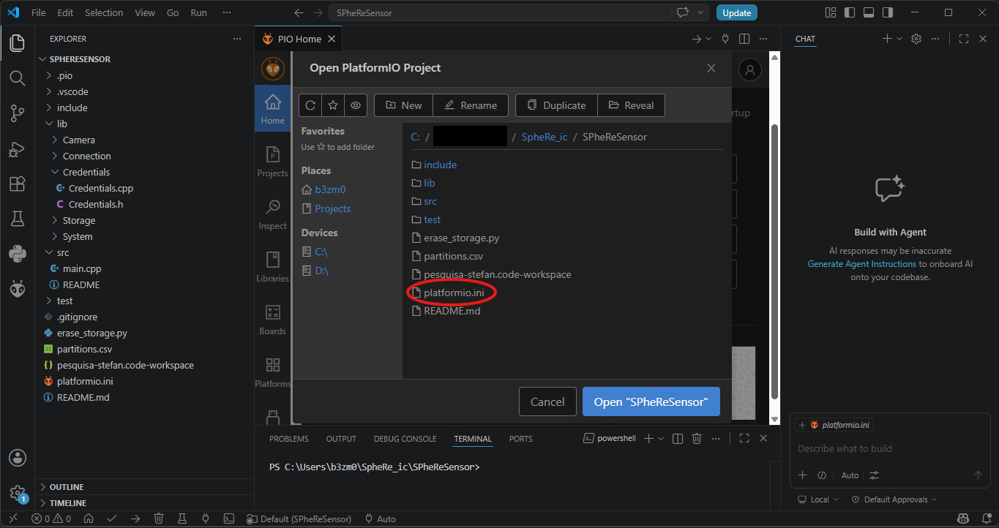

# Documentação do código SPheRe

---

Link do repositório: https://github.com/gabrielbezmor/SpheRe_ic.git

## Requisitos:

Instale o VSCode e a extensão do PlatformIO

---

## Código da câmera

O código da câmera está localizado na pasta “SPheReSensor”. O código foi segmentado em duas pastas, src, que contém apenas o arquivo “main” e lib, que contém todos os códigos auxiliares.

O código segue a arquitetura da máquina de estados finitos desenvolvida por Flávio, contendo os seguintes estados:

- moisture_read: Lê a umidade do sensor
- send_image: Captura e envia uma imagem
- pump_control: Emite o sinal para ativar a bomba (não estamos usando)
- send_data: Envia dados do sensor de umidade para a planilha
- deep_sleep: “Apaga” a câmera para poupar energia

---

#### Requisitos PlatformIO

O PlatformIO lê o arquivo “platformio.ini” e automaticamente instala todas as bibliotecas necessárias. Esse arquivo também serve para armazenar opções de compilação e configuração do dispositivo.

#### Usando o PlatformIO

A extensão do PlatformIO, além de automaticamente instalar as dependências, facilita o processo de compilação, build e upload do código, além de permitir monitorar a entrada e saída serial da câmera.

Após instalar o PlatformIO, procure na barra lateral o símbolo da extensão e clique nele

Então, clique em Open project e selecione a pasta SPheReSensor. Certifique-se de que a pasta contém o arquivo platformio.ini

O PlatformIO deve, então, baixar as dependências do projeto e se configurar automaticamente. Após o término da configuração, você poderá editar os arquivos do projeto. Quando quiser compilar, fazer upload, ou monitorar a câmera, basta procurar no canto superior direito, ou na aba da extensão, as opções de Build, Upload ou Monitor. 

Para fazer upload ou monitorar a câmera, é necessário estar com o dispositivo conectado ao computador. Lembre-se de alterar as variáveis monitor_port e upload_port no arquivo platformio.ini para condizer com as da sua máquina.

---

#### Main

O código da main é composto por duas funções: Setup, que é executada assim que a câmera liga e Loop, que fica em execução permanentemente após Setup finalizar.

#### Setup

A função Setup faz os seguintes passos:

1. Desativa a detecção de Brown-out. Isso evita que a câmera desligue ao conectar no wifi ou tirar uma foto.
2. Espera até detectar um monitor, por no máximo 5 segundos (deve ser removido após testes e debugging)
3. Chama Connection.setup()
4. Envia imagem “dummy”
5. Configura resolução do ADC e pinos (não entendi)
6. Configura o período de duração de deep_sleep
7. Determina o estado inicial (moisture_read)
8. Chama Connection.setup() (de novo, não sei por que)
9. Chama Storage.setup()

#### Loop

Loop simplesmente chama handlestates, que é uma função presente em lib/System que segue a lógica da máquina de estados finitos projetada por Flávio. 

---

### Lib

Lib contém arquivos que regem:

- Armazenamento do sensor
- Configurações da câmera
- Conexão com a Internet
- Credenciais
- “Sistema operacional”

O sistema já estava em funcionamento, portanto, a única coisa que precisa ser alterada são as credenciais.
Crie, conforme descrito no arquivo Credentials.h, um arquivo Credentials.cpp, na pasta Credentials. Insira o SSID e a senha da rede que será utilizada para conectar a câmera nas variáveis WIFI_SSID e WIFI_PASS.

Insira em GOOGLE_SHEETS_SCRIPT_ID o ID do script responsável por enviar os dados para a planilha
Insira em GOOGLE_DRIVE_SCRIPT_ID o ID do script responsável por enviar as fotos para a pasta no drive
Insira em DEVICE_NAME o nome da câmera que se está testando (podemos definir os nomes depois)

Insira em LOGS_SCRIPT_ID o ID do script responsável pelo envio de logs (ainda inexistente)

Não compartilhe o seu arquivo de Credenciais no github.

---

# Problemas comuns:

## Câmera não consegue conectar à internet:

Confira se as credenciais de acesso estão corretas. Caso estejam, confira se a rede a qual está tentando conectar tem banda de rede igua 2.4GHz, pois as câmeras que temos não conseguem detectar redes com banda de 5GHz.

## Câmera captura imagens verdes:

Ainda não sei resolver esse problema, provavelmente é alguma dessas causas:

- Película de proteção da lente não foi removida
- Mau contato no cabo da câmera
- Configuração inapropriada da câmera
- Falha no hardware

---

# Problemas do código:

- Dependência de google scripts, pois a lógica de envio dos dados está atrelada ao uso de google scripts.
